# 🚀 Vibe Coding Template

**Complete workflow for rapid app development and deployment using Humanitec on GCP**

## 🎯 What is Vibe Coding?

Vibe coding is a rapid development workflow where you can:
1. **Create a new repo** in `htc-demo-00-gcp`
2. **Copy template files** from this repo
3. **Build your app** (Node.js, port 3000)
4. **Push to main** → **Auto-deploys** via Humanitec to GCP

**Zero manual deployment setup needed!**

## 🏃‍♂️ Quick Start

### When a user says "let's vibe code XYZ":

1. **Create new repo:**
   ```bash
   gh repo create htc-demo-00-gcp/APP_NAME --public --description "DESCRIPTION" --clone
   cd APP_NAME
   ```

2. **Copy template files (CRITICAL - All files required!):**
   ```bash
   # Copy deployment files - ALL REQUIRED FOR DEPLOYMENT TO WORK
   cp /path/to/vibe-coding-template/Dockerfile .
   cp /path/to/vibe-coding-template/manifest.yaml .
   cp -r /path/to/vibe-coding-template/.github .     # ⚠️  CRITICAL: GitHub Actions workflows
   cp -r /path/to/vibe-coding-template/chart .
   ```

3. **Copy app structure and customize:**
   ```bash
   # Copy example app structure
   cp /path/to/vibe-coding-template/package.json .
   cp /path/to/vibe-coding-template/server.js .
   cp -r /path/to/vibe-coding-template/public .
   
   # Update package.json name and description to match your app
   # Update server.js and public/index.html for your app functionality
   ```

4. **VERIFY before committing:**
   ```bash
   # ✅ MANDATORY VERIFICATION - Ensure deployment will work
   ls -la .github/workflows/deploy_to_default_environment.yaml
   # Should show the file exists. If not, deployment will fail!
   ```

5. **Commit and deploy:**
   ```bash
   git add .
   git commit -m "Initial commit: APP_NAME

   🚀 Generated with [Claude Code](https://claude.ai/code)
   Co-Authored-By: Claude <noreply@anthropic.com>"
   git push origin main
   ```

6. **Monitor deployment:**
   - **IMMEDIATELY check:** `https://github.com/htc-demo-00-gcp/APP_NAME/actions`
   - Should see "Deploy to default environment" workflow running
   - If no workflow appears, the .github directory wasn't copied correctly!
   - URL appears in "Wait for service and show URL" step: `🎉 App is ready at http://X.X.X.X`

## 📁 Template Files Explained

### Core Deployment Files
- **`.github/workflows/deploy_to_default_environment.yaml`** - Main deployment pipeline
- **`manifest.yaml`** - Humanitec resource definitions
- **`chart/`** - Helm chart for Kubernetes deployment
- **`Dockerfile`** - Container configuration for Node.js apps

### Example App Files
- **`package.json`** - Node.js dependencies
- **`server.js`** - Express server example
- **`public/index.html`** - Frontend example

## 🎮 Deployment Pipeline Flow

```mermaid
graph LR
    A[Push to main] --> B[GitHub Actions]
    B --> C[Create Humanitec Project]
    B --> D[Build Docker Image]
    D --> E[Push to GCR]
    E --> F[Deploy via Humanitec]
    F --> G[Deploy to GKE]
    G --> H[Expose LoadBalancer]
    H --> I[🎉 Live App]
```



### Pipeline Steps:
1. **Scaffold Job:**
   - Creates Humanitec project (repo name)
   - Creates default development environment

2. **Release Job:**
   - Authenticates to Google Cloud
   - Builds and pushes Docker image to `europe-west3-docker.pkg.dev/htc-demo-00-gcp`
   - Provisions infrastructure via Humanitec
   - Deploys to GKE cluster `second-call-demo-gke`
   - Exposes service with LoadBalancer IP

## 🛠️ Available Humanitec Resources

Add any of these to your `manifest.yaml`:

### Storage & Data
```yaml
database:
  type: postgres          # PostgreSQL database
cache:
  type: redis            # Redis cache
storage:
  type: bucket           # Google Cloud Storage
```

### Messaging
```yaml
queue:
  type: queue            # Google Cloud Pub/Sub
messaging:
  type: rabbitmq         # RabbitMQ broker
```

### Kubernetes
```yaml
web:
  type: ingress          # External access
namespace:
  type: k8s-namespace    # Kubernetes namespace
account:
  type: k8s-service-account # Service account
```

### Compute & Functions
```yaml
function:
  type: lambda           # AWS Lambda
gpu:
  type: gpu-compute      # GPU instances for AI
```

### Infrastructure
```yaml
api:
  type: api-gateway      # API Gateway
domain:
  type: dns              # DNS management
```

## 📋 Resource Output Variables

Resources automatically provide output variables:

```yaml
# Example: Using bucket resource
workloads:
  main:
    resources:
      storage:
        type: bucket
    variables:
      BUCKET_NAME: ${resources.storage.outputs.name}
```

**Available outputs by resource type:**
- **bucket:** `name`
- **postgres:** `connection_string`, `host`, `port`, `username`, `database`
- **redis:** `connection_string`, `host`, `port`, `password`
- **queue:** `name`
- **k8s-namespace:** `namespace`
- **k8s-service-account:** `service_account_name`
- **ingress:** `host`, `ip`, `url`

## 🎯 Example: Adding Google Cloud Storage

1. **Update manifest.yaml:**
```yaml
workloads:
  main:
    resources:
      bucket:
        type: bucket
      # ... other resources
    variables:
      BUCKET_NAME: ${resources.bucket.outputs.name}
      # ... other variables
```

2. **Add to package.json:**
```json
{
  "dependencies": {
    "express": "^4.18.2",
    "@google-cloud/storage": "^7.5.0",
    "multer": "^1.4.5"
  }
}
```

3. **Use in server.js:**
```javascript
const { Storage } = require('@google-cloud/storage');
const storage = new Storage();
const bucketName = process.env.BUCKET_NAME;
```

## 🚨 Requirements

### GitHub Organization Setup
- **Org:** `htc-demo-00-gcp`
- **Required secrets:**
  - `CANYON_DEMO_CANYON_AUTH_TOKEN_PROD` - Humanitec auth
  - `CANYON_DEMO_CANYON_ORG` - Humanitec org ID  
  - `CANYON_DEMO_GCP_CREDENTIALS` - GCP service account JSON

### App Requirements
- **Node.js** application
- **Runs on port 3000**
- **Has `npm start` command**
- **Containerizable** (uses provided Dockerfile)

## 🔧 Troubleshooting

### Pipeline fails at "Create project" step
- Project already exists (normal, continues with `continue-on-error: true`)

### Pipeline fails at "Build and push Docker image"
- Check Dockerfile compatibility
- Ensure `npm install` succeeds
- Verify port 3000 is exposed

### Pipeline fails at "Provision infrastructure"
- Check `manifest.yaml` syntax
- Verify resource types exist in organization
- Check Humanitec auth token permissions

### App deployed but not accessible
- Wait for LoadBalancer IP assignment (can take 5-10 minutes)
- Check "Wait for service and show URL" step for IP
- Verify GKE cluster `second-call-demo-gke` is running

### Getting 403 errors with hctl
- Ensure using correct org: `--org htc-demo-00-gcp`
- Check if logged in: `hctl login`
- Verify auth token has proper permissions

## 🎨 Customization

### Different App Types
- **Python:** Update Dockerfile, use `python app.py`
- **Go:** Update Dockerfile, change port exposure
- **Static sites:** Use nginx base image

### Different Resources
- Add any combination of resources to `manifest.yaml`
- Environment variables automatically available in container
- Use in your app via `process.env.VARIABLE_NAME`

### Custom Domains
- Add `dns` resource to manifest
- Configure ingress resource
- Point domain to LoadBalancer IP

## 🎯 Success Indicators

✅ **Repository created** in htc-demo-00-gcp  
✅ **Template files copied** successfully  
✅ **GitHub Actions running** after push  
✅ **Humanitec project created** (check logs)  
✅ **Docker image built** and pushed to GCR  
✅ **Infrastructure provisioned** via Humanitec  
✅ **App deployed** to GKE  
✅ **LoadBalancer IP assigned** and displayed  
✅ **App accessible** at http://IP  

---

## 💡 Pro Tips

1. **Always use `htc-demo-00-gcp` org** for Humanitec commands
2. **Watch GitHub Actions** for deployment progress  
3. **URL appears** in final pipeline step
4. **Resources are auto-provisioned** - no manual GCP setup needed
5. **Environment variables** are automatically injected from Humanitec

---

## 🧹 Cleanup After Vibe Coding

**IMPORTANT: Clean up in this exact order to avoid errors!**

### 1. Delete Humanitec Environments First
```bash
# List all environments for the project
hctl get environments --project APP_NAME --org htc-demo-00-gcp

# Delete each environment (usually just "development")
hctl delete environment development --project APP_NAME --org htc-demo-00-gcp

# Verify environments are deleted
hctl get environments --project APP_NAME --org htc-demo-00-gcp
# Should show empty or "No environments found"
```

### 2. Delete Humanitec Project
```bash
# Only after ALL environments are deleted
hctl delete project APP_NAME --org htc-demo-00-gcp

# Verify project is deleted
hctl get projects --org htc-demo-00-gcp | grep APP_NAME
# Should show no results
```

### 3. Clean up GitHub Repo
```bash
# ⚠️ MANUAL STEP: GitHub repo must be deleted manually
# Go to: https://github.com/htc-demo-00-gcp/APP_NAME/settings
# Scroll to "Danger Zone" → "Delete this repository"
# (Cannot be automated due to auth restrictions)
```

### 4. Clean up Local Files
```bash
# Remove local repo directory
cd ..
rm -rf APP_NAME
```

### 🚨 Troubleshooting Cleanup

**"Cannot delete project - environments exist"**
- You must delete ALL environments first
- Check: `hctl get environments --project APP_NAME --org htc-demo-00-gcp`
- Delete any remaining environments before deleting project

**"Environment is still provisioning"**
- Wait for deployment to complete first
- Check GitHub Actions status before cleanup
- Running deployments can prevent environment deletion

**"Permission denied" errors**
- Ensure using correct org: `--org htc-demo-00-gcp`
- Check if logged in: `hctl login`
- Verify your token has delete permissions

---

**Ready to vibe code? Let's build something awesome! 🚀**